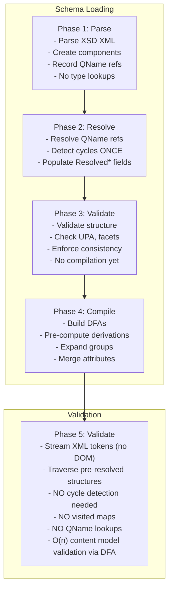
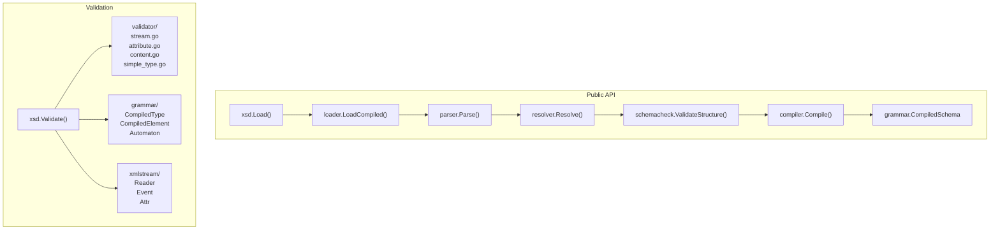
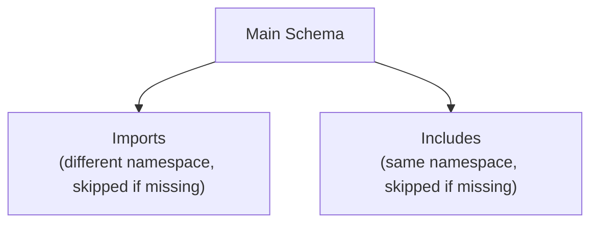
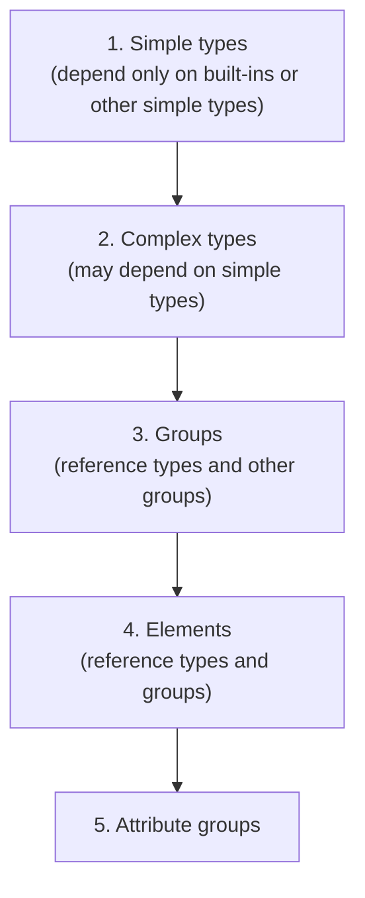
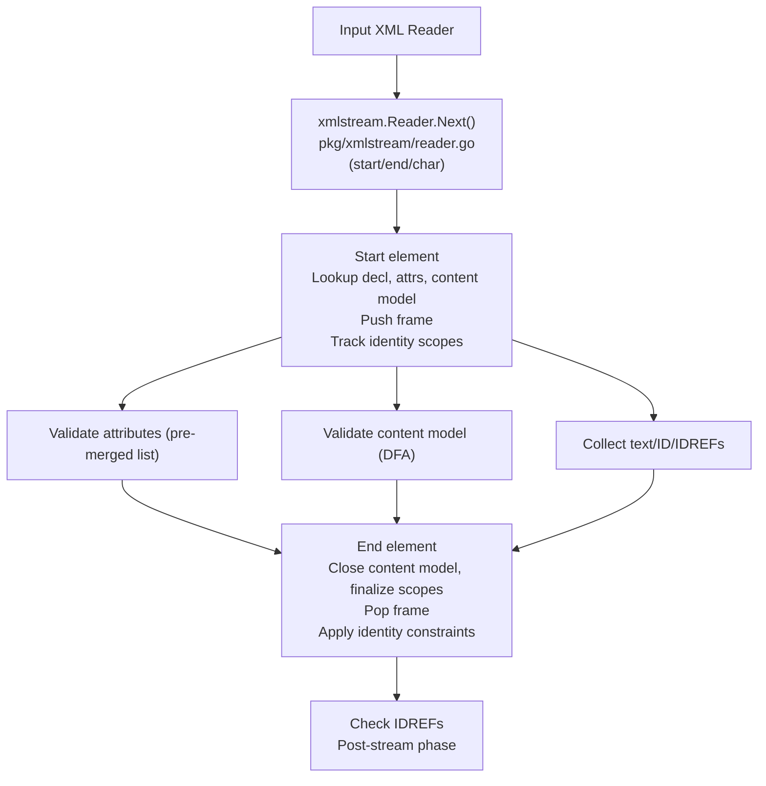
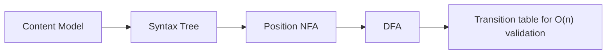

# XSD 1.0 Validator Architecture

Pure Go implementation of XSD 1.0 validation using io/fs for schema loading.

## Overview

This validator implements W3C XML Schema 1.0 validation with the following priorities:

- Pure Go with no CGO dependencies
- io/fs integration for flexible schema loading
- W3C compliance tested against the W3C XSD Test Suite
- Streaming validation with constant memory use
- Multi-phase processing for clean separation of concerns

## Schema Location Hints

Instance-document schema hints (`xsi:schemaLocation`, `xsi:noNamespaceSchemaLocation`) are ignored.
Validation always uses the compiled schema provided to `xsd.Load`/`xsd.LoadFile`, keeping
validation deterministic and goroutine-safe.


## Processing Pipeline

Schema loading and validation follows five distinct phases:




## Component Relationships




## Phase 1: Parse

The parser reads XSD files and creates schema components with QName references.
No lookups or resolution occurs in this phase.

```go
// parser creates components with unresolved QName references
type SimpleType struct {
    QName       QName
    Restriction *Restriction  // Contains Base QName, not resolved type
}

// Base is stored as QName, not pointer
type Restriction struct {
    Base   QName  // e.g., {http://www.w3.org/2001/XMLSchema}string
    Facets []Facet
}
```

Import and include resolution happens during parsing to load all schema documents.
Missing include/import files are ignored when the filesystem returns fs.ErrNotExist,
and imports without schemaLocation are skipped.




## Phase 2: Resolve

The resolver processes all QName references exactly once, detects cycles,
and populates resolved pointer fields.

```go
// After resolution, types have direct pointers
type SimpleType struct {
    QName        QName
    Restriction  *Restriction
    ResolvedBase types.Type  // Direct pointer to base type
}
```

Resolution order matters due to dependencies:



Cycle detection happens once during resolution. After phase 2 completes,
no visited maps are needed anywhere in the codebase.

Cycle detection uses QName-based tracking for named components and
pointer-based tracking for anonymous types and attribute group instances
to avoid false positives in redefine contexts.


## Phase 3: Validate Schema

Schema validation checks structural rules before compilation. This phase enforces
UPA constraints, derivation rules, and facet applicability with all references resolved.


## Phase 4: Compile

The compiler transforms the resolved schema into an optimized grammar structure.

CompiledSchema contains:

- Direct lookup tables for elements, types, attributes
- Pre-computed derivation chains
- Pre-merged attributes from type hierarchies
- Pre-built DFAs for content model validation
- Transitive closure of substitution groups

```go
type CompiledType struct {
    QName           QName
    Kind            TypeKind           // Simple, Complex, Builtin
    BaseType        *CompiledType      // Direct pointer
    DerivationChain []*CompiledType    // [self, base, grandbase, ...]
    AllAttributes   []*CompiledAttribute  // Merged from all ancestors
    ContentModel    *CompiledContentModel // Pre-compiled DFA
    Facets          []types.Facet      // All applicable facets
}
```


## Phase 5: Validate

Validation streams tokens and validates incrementally with no DOM build.




## DFA Content Model Validation

Content models are compiled to Deterministic Finite Automata using
Glushkov construction followed by subset construction.



### Glushkov Construction

The algorithm computes position sets for each node in the syntax tree:

```
nullable(n)  : Can node n match empty string?
firstPos(n)  : Positions that can match first symbol
lastPos(n)   : Positions that can match last symbol
followPos(p) : Positions that can follow position p
```

Position set computation rules:

```
Sequence (a . b):
  nullable = nullable(a) AND nullable(b)
  firstPos = firstPos(a) UNION (if nullable(a) then firstPos(b))
  lastPos  = lastPos(b) UNION (if nullable(b) then lastPos(a))
  
Choice (a | b):
  nullable = nullable(a) OR nullable(b)
  firstPos = firstPos(a) UNION firstPos(b)
  lastPos  = lastPos(a) UNION lastPos(b)

Star (a*):
  nullable = true
  firstPos = firstPos(a)
  lastPos  = lastPos(a)

FollowPos rules:
  For sequence a.b: for each p in lastPos(a), add firstPos(b) to followPos(p)
  For star a*:      for each p in lastPos(a), add firstPos(a) to followPos(p)
```

### Subset Construction

Converts NFA position sets to DFA states:

```
Initial state = firstPos(root)

For each state S and symbol a:
    next(S, a) = UNION of followPos(p) for all p in S matching a

State is final if it contains the end-of-content position
```

### Automaton Structure

```go
type Automaton struct {
    symbols   []Symbol      // Alphabet (element QNames, wildcards)
    trans     []int         // [state*symbolCount + symbol] -> next state (-1)
    accepting []bool        // Final states
    counting  []*Counter    // Occurrence constraints per state
    emptyOK   bool          // Can content be empty?
}
```

### Validation (O(n) time, no backtracking)

```
state = 0
for each child element:
    symbolIdx = findMatchingSymbol(child)
    if symbolIdx < 0:
        return error: element not allowed
    
    nextState = trans[state*symbolCount+symbolIdx]
    if nextState < 0:
        return error: element not expected here
    
    if counting[state] != nil:
        check occurrence constraints
    
    state = nextState

if not accepting[state]:
    return error: content incomplete
```

### All Groups

All groups allow children in any order. The validator uses a dedicated
array-based check instead of DFA expansion, tracking seen elements and
required counts.

XSD 1.0 limits all groups to simple particles (no nested groups, maxOccurs <= 1),
which keeps validation deterministic.


## Pattern Facet (Regex Translation)

XSD patterns are translated to Go regexp (RE2) with fail-closed semantics:
either produce a provably equivalent pattern or return an error.

### Translation Rules

| XSD Pattern           | Go/RE2 Pattern                    |
|-----------------------|-----------------------------------|
| (implicit anchoring)  | \A(?:PAT)\z                       |
| ^ $ (outside class)   | \^ \$                             |
| .                     | [^\n\r]                           |
| \d                    | Unicode 3.1 decimal digit ranges  |
| \D                    | Complement of Unicode 3.1 digits  |
| \s                    | [\x20\t\n\r]                      |
| \S                    | [^\x20\t\n\r]                     |
| \w                    | Unicode 3.1 word characters       |
| \W                    | Complement of Unicode 3.1 word chars |
| \p{Lu}                | \p{Lu} (supported categories only)|
| \X (unknown escape)   | literal X                         |

### Supported Features

- Literals, grouping (), alternation |, concatenation
- Quantifiers ? * + {m} {m,} {m,n} with bounds <= 1000
- Character classes [...] without subtraction
- Unicode property escapes for Go-supported categories
- XSD shorthands: . \d \D \s \S \w \W

### Rejected Features (fail closed)

- Character-class subtraction: [A-Z-[AEIOU]]
- Unicode block escapes: \p{IsBasicLatin}
- XML NameChar escapes: \i \c \I \C
- Counted repeats > 1000 (RE2 limit)
- \w \S inside negated character classes
- Non-greedy quantifiers (not in XSD 1.0)

### Unicode Version Note

XSD 1.0 regex semantics are defined over Unicode 3.1. Go regexp uses the
current Unicode version. The \d \D \w \W shorthands are implemented as
explicit Unicode 3.1 character ranges to maintain spec compliance.


## DateTime Handling

DateTime types use Go time.Parse with the following limitations:

- Supported year range: 0001-9999
- No support for year 0, BCE dates, or years > 9999
- XSD allows arbitrary precision years; Go does not

```go
// DateTime parsing attempts multiple formats
func validateDateTime(value string) error {
    _, err := time.Parse(time.RFC3339, value)
    if err != nil {
        _, err = time.Parse("2006-01-02T15:04:05", value)
    }
    return err
}
```


## Built-in Types

The type hierarchy follows XSD 1.0 specification:

```
anyType
    |
    +-- anySimpleType
            |
            +-- string
            |     +-- normalizedString
            |           +-- token
            |                 +-- language
            |                 +-- Name
            |                 |     +-- NCName
            |                 |           +-- ID
            |                 |           +-- IDREF
            |                 |           +-- ENTITY
            |                 +-- NMTOKEN
            |
            +-- decimal
            |     +-- integer
            |           +-- long
            |           |     +-- int
            |           |           +-- short
            |           |                 +-- byte
            |           +-- nonNegativeInteger
            |           |     +-- positiveInteger
            |           |     +-- unsignedLong
            |           |           +-- unsignedInt
            |           |                 +-- unsignedShort
            |           |                       +-- unsignedByte
            |           +-- nonPositiveInteger
            |                 +-- negativeInteger
            |
            +-- boolean
            +-- float
            +-- double
            +-- duration
            +-- dateTime
            +-- time
            +-- date
            +-- gYearMonth
            +-- gYear
            +-- gMonthDay
            +-- gDay
            +-- gMonth
            +-- hexBinary
            +-- base64Binary
            +-- anyURI
            +-- QName
            +-- NOTATION
```


## W3C Error Codes

Validation errors use standard W3C codes:

```
cvc-elt.1              Cannot find declaration for element
cvc-elt.2              Element is abstract
cvc-elt.3.1            xsi:nil on non-nillable element
cvc-elt.3.2.2          Non-empty content in nilled element
cvc-elt.5.2.2          Fixed value mismatch
cvc-type.2             Abstract type used directly
cvc-complex-type.2.1   Non-empty content for empty type
cvc-complex-type.2.3   Text in element-only content
cvc-complex-type.2.4.a Invalid child element
cvc-complex-type.2.4.b Missing required element
cvc-complex-type.2.4.d Unexpected element
cvc-complex-type.3.2.2 Undeclared attribute
cvc-complex-type.4     Missing required attribute
cvc-attribute.4        Attribute fixed value mismatch
cvc-datatype-valid.1   Invalid datatype value
cvc-facet-valid        Facet constraint violation
cvc-id.1               IDREF without matching ID
cvc-id.2               Duplicate ID
cvc-identity-constraint.4.1  Duplicate key/unique value
cvc-identity-constraint.4.3  Keyref without matching key
cvc-wildcard.2         Namespace constraint violation
cvc-assess-elt.1.1.1   No declaration for strict wildcard
```


## Design Decisions

### No HTTP Imports

Schema loading only supports io/fs sources. Remote schema fetching via HTTP
is not supported to avoid network dependencies and security concerns.

### No Redefine Support

The xs:redefine construct is deprecated in XSD 1.1 and complex to implement
correctly. This validator does not support it.

### Go-Compatible Regex Only

Patterns that cannot be safely translated to RE2 are rejected. This includes
character-class subtraction, Unicode block escapes, and XML NameChar escapes.

### Go Time Limitations

DateTime validation uses Go time.Parse, limiting years to 0001-9999.
XSD allows arbitrary precision years, but supporting them would require
a custom datetime implementation.


## References

- XSD 1.0 Structures: https://www.w3.org/TR/xmlschema-1/
- XSD 1.0 Datatypes: https://www.w3.org/TR/xmlschema-2/
- W3C XSD Test Suite: https://github.com/w3c/xsdtests
