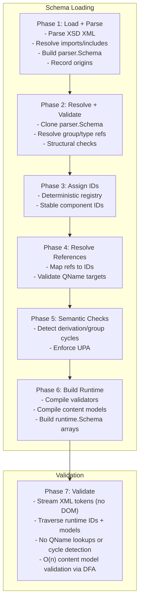
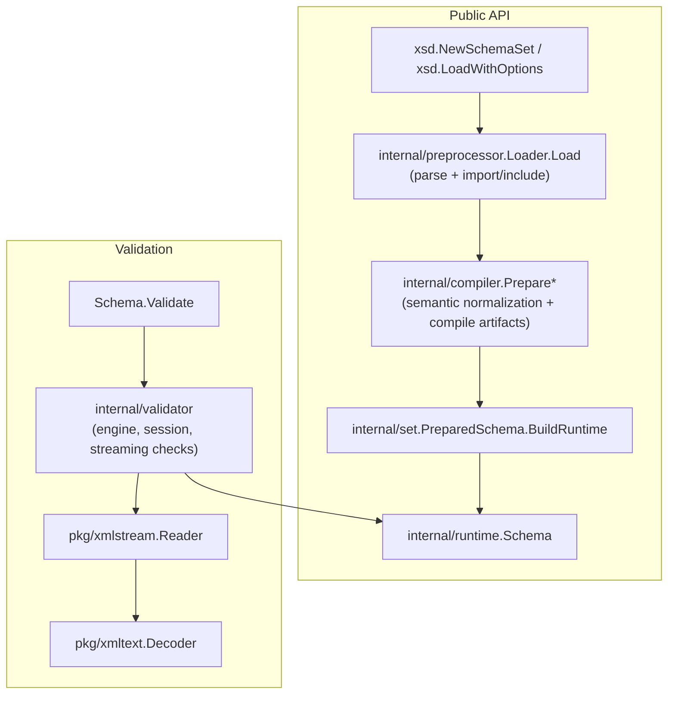
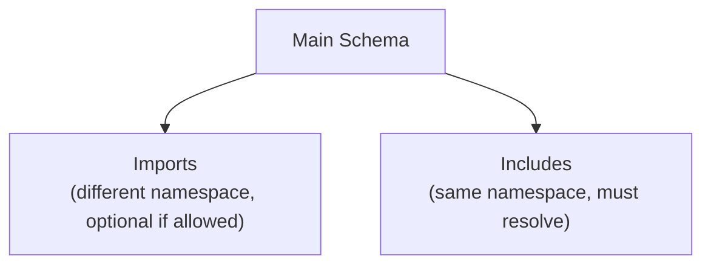
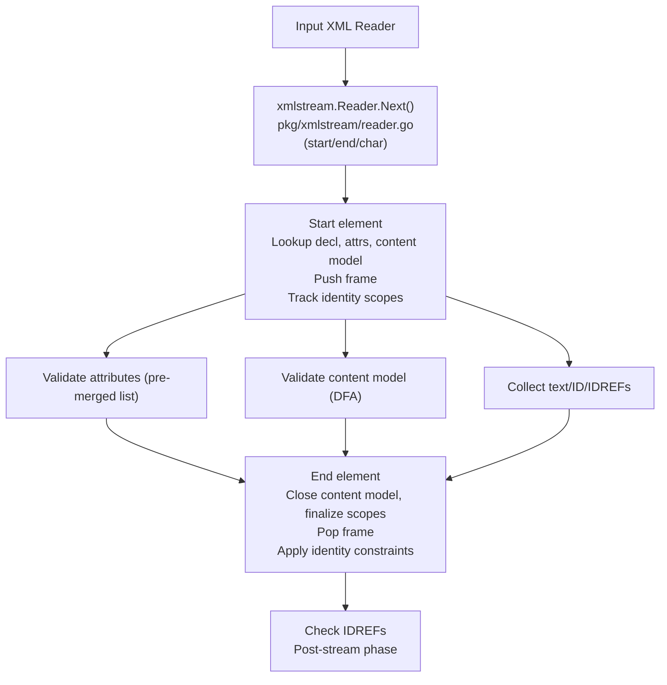
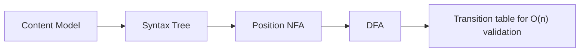

# XSD 1.0 Validator Architecture

Pure Go implementation of XSD 1.0 validation using io/fs for schema loading.

## Overview

This validator implements W3C XML Schema 1.0 validation with the following priorities:

- Pure Go with no CGO dependencies
- io/fs integration for flexible schema loading
- W3C compliance tested against the W3C XSD Test Suite
- Streaming validation without building a DOM
- Multi-phase processing for clean separation of concerns

## Schema Location Hints

Instance-document schema hints (`xsi:schemaLocation`, `xsi:noNamespaceSchemaLocation`) are ignored.
Validation always uses the compiled schema created by
`xsd.NewSchemaSet().WithLoadOptions(...).Compile(...)`, `xsd.LoadWithOptions`, or `xsd.LoadFile`.
This keeps validation deterministic and goroutine-safe.

## Processing Pipeline

Schema loading and validation follows seven distinct phases:




## Component Relationships



## Package Organization

The codebase uses phase-oriented package boundaries instead of type-name parity.
Each package owns one phase-level responsibility:

- `internal/preprocessor`: source loading, include/import resolution, origin tracking.
- `internal/parser`: raw XSD component parsing with symbolic references.
- `internal/normalize`: orchestration of schema normalization stages.
- `internal/semanticresolve`: schema reference wiring and semantic link resolution.
- `internal/semanticcheck`: structural/spec validation (`cvc-*`/schema rules, UPA checks).
- `internal/analysis`: deterministic IDs, ordering, and resolved-reference indexes.
- `internal/set`: prepare/build orchestration for reusable schema artifacts.
- `internal/runtimeassemble`: compilation of normalized artifacts into runtime tables.
- `internal/validator`: mutable runtime session execution over immutable runtime schema.

Public package organization follows the same single-responsibility rule:

- `schema_types.go`: public schema/QName types.
- `load.go`: schema loading entrypoints.
- `schema_validate.go`: validation entrypoints and file-reader plumbing.
- `schemaset_*.go`: schema-set ingestion, prepare/compile orchestration, and merge flow.
- `options_*.go`: option types, fluent API, and resolution/defaulting.

Architecture boundaries are enforced by tests in `internal/architecture/`:

- import-edge checks for core phases (`import_edges_test.go`)
- public export allowlist checks (`public_api_allowlist_test.go`)
- legacy package removal and required phase docs (`layout_test.go`)

## Shared Internal Helpers

To keep package boundaries one-way and avoid drift between phases, shared
helpers live in reusable internal packages:

- `internal/typeresolve`: type reference resolution policy and facet traversal helpers.
- `internal/typechain`: base-chain navigation and anyType semantics.
- `internal/traversal`: particle/content tree walkers reused by resolver and semantic checks.
- `internal/valuecodec`: canonical key encoding used by runtime build and runtime validation.
- `internal/durationlex`: shared xs:duration lexical parser reused by `model`, `facetvalue`, and `valueparse`.

These packages are intentionally dependency-light and avoid load orchestration
or validator session state.


## Phase 1: Load + Parse

Schema loading uses `internal/preprocessor` and `internal/parser` to parse XSD documents,
resolve includes/imports, and build a single parser.Schema. QName references and
origin locations are recorded, but no runtime IDs or compiled models exist yet.

```go
// parser creates components with unresolved QName references
type SimpleType struct {
    QName       QName
    Restriction *Restriction  // Contains Base QName, not resolved type
}

// Base is stored as QName, not pointer
type Restriction struct {
    Base   QName  // e.g., {http://www.w3.org/2001/XMLSchema}string
    Facets []Facet
}
```

Import and include resolution happens during loading to assemble all schema
documents. Includes must resolve successfully. Imports without a schemaLocation
are rejected unless `LoadOptions.WithAllowMissingImportLocations(true)` is used.
Missing import files are only skipped when that option is enabled; otherwise
they are errors.




## Phase 2: Resolve + Validate

`internal/compiler.Prepare` clones the parsed schema for defensive callers,
while `PrepareOwned` validates in-place for owned pipeline paths. Both resolve
group/type references and run structure/reference checks.

## Phase 3: Assign IDs

`internal/compiler` (via registry planning passes) walks the validated schema in deterministic order and
assigns stable IDs to globally visible declarations plus local/anonymous components.
These IDs back the runtime registry.

```go
type Registry struct {
    Types        map[model.QName]TypeID
    Elements     map[model.QName]ElemID
    Attributes   map[model.QName]AttrID
    TypeOrder    []TypeEntry
    ElementOrder []ElementEntry
    AttributeOrder []AttributeEntry
}
```

## Phase 4: Resolve References

`internal/compiler` validates QName references against the
registry and builds ID-based lookup maps without mutating parser.Schema.

```go
type ResolvedReferences struct {
    ElementRefs   map[model.QName]ElemID
    AttributeRefs map[model.QName]AttrID
    GroupRefs     map[model.QName]model.QName
}
```

Resolution traverses global declarations in schema.GlobalDecls order and
recurses into referenced types, groups, and attribute groups as needed.
After this phase, runtime validation no longer needs QName lookups.


## Phase 5: Semantic Checks

Before runtime build, compiler semantic passes run cycle detection and UPA checks on
the validated schema and assigned registry.

## Phase 6: Build Runtime Schema

`internal/set.PreparedSchema.BuildRuntime` (backed by
`internal/compiler`, `internal/runtimeassemble`, and `internal/validatorgen`)
compiles prepared artifacts into an optimized runtime representation. The runtime schema is
dense, ID-based, and immutable so it can be shared across goroutines.

At the public API layer, `xsd.SchemaSet.Compile`/`CompileWithRuntimeOptions`
compile runtime schemas from the set’s added roots using compile-affecting
runtime options (`maxDFAStates`, `maxOccursLimit`). Instance XML parse limits
are applied per engine/session and do not change schema semantics.

runtime.Schema contains:

- Stable ID-based tables for elements, types, attributes
- Pre-computed derivation chains and ancestor masks
- Pre-merged attributes from type hierarchies
- Compiled DFA/NFA/all models for content validation
- Pre-compiled simple-type validators and default/fixed values

```go
// abridged from internal/runtime/schema.go
type Schema struct {
    Symbols    SymbolsTable
    Namespaces NamespaceTable

    GlobalElements []ElemID

    Types        []Type
    Ancestors    TypeAncestors
    ComplexTypes []ComplexType
    Elements     []Element
    Attributes   []Attribute
    AttrIndex    ComplexAttrIndex

    Models     ModelsBundle
    Validators ValidatorsBundle
}
```


## Phase 7: Validate

Validation streams tokens through internal/validator sessions using the immutable
runtime.Schema; no DOM build is required.




## DFA Content Model Validation

Content models are compiled to Deterministic Finite Automata using
Glushkov construction followed by subset construction.



### Glushkov Construction

The algorithm computes position sets for each node in the syntax tree:

```
nullable(n)  : Can node n match empty string?
firstPos(n)  : Positions that can match first symbol
lastPos(n)   : Positions that can match last symbol
followPos(p) : Positions that can follow position p
```

Position set computation rules:

```
Sequence (a . b):
  nullable = nullable(a) AND nullable(b)
  firstPos = firstPos(a) UNION (if nullable(a) then firstPos(b))
  lastPos  = lastPos(b) UNION (if nullable(b) then lastPos(a))
  
Choice (a | b):
  nullable = nullable(a) OR nullable(b)
  firstPos = firstPos(a) UNION firstPos(b)
  lastPos  = lastPos(a) UNION lastPos(b)

Star (a*):
  nullable = true
  firstPos = firstPos(a)
  lastPos  = lastPos(a)

FollowPos rules:
  For sequence a.b: for each p in lastPos(a), add firstPos(b) to followPos(p)
  For star a*:      for each p in lastPos(a), add firstPos(a) to followPos(p)
```

### Subset Construction

Converts NFA position sets to DFA states:

```
Initial state = firstPos(root)

For each state S and symbol a:
    next(S, a) = UNION of followPos(p) for all p in S matching a

State is final if it contains the end-of-content position
```

### Automaton Structure

```go
// from internal/runtime/models.go
type DFAModel struct {
    States      []DFAState
    Transitions []DFATransition
    Wildcards   []DFAWildcardEdge
    Start       uint32
}

type DFAState struct {
    Accept   bool
    TransOff uint32
    TransLen uint32
    WildOff  uint32
    WildLen  uint32
}

type DFATransition struct {
    Sym  SymbolID
    Next uint32
    Elem ElemID
}
```

### Validation (O(n) time, no backtracking)

```
state = model.Start
for each child element:
    edge = match transition in state.Transitions/state.Wildcards
    if edge is absent:
        return error: element not expected here

    state = edge.Next

if not state.Accept:
    return error: content incomplete
```

### All Groups

All groups allow children in any order. The validator uses a dedicated
array-based check instead of DFA expansion, tracking seen elements and
required counts.

XSD 1.0 limits all groups to simple particles (no nested groups, maxOccurs <= 1),
which keeps validation deterministic.


## Pattern Facet (Regex Translation)

XSD patterns are translated to Go regexp (RE2) using fail-closed semantics:
either produce a valid translation or return an error.

Source of truth: `internal/model/TranslateXSDPatternToGo`.

### Key behavior

- Patterns are implicitly anchored by wrapping as `^(?:...)$`.
- `.` is translated as `[^\n\r]` per XSD line-end rules.
- XSD shorthands are supported: `\d`, `\D`, `\s`, `\S`, `\w`, `\W`,
  `\i`, `\I`, `\c`, `\C`.
- Unicode property escapes `\p{...}` / `\P{...}` are accepted when Go regexp
  supports the property.

### Rejected patterns

- Character-class subtraction (`-[` form).
- Nested character classes.
- Non-greedy quantifiers (lazy quantifiers).
- Backreferences and non-XSD escape sequences.
- Unicode block escapes (`\p{Is...}` / `\p{In...}`).
- Repeat bounds above the RE2 limit.


## DateTime Handling

Temporal primitive parsing uses Go's time APIs and internal temporal helpers,
with these limits:

- Supported year range: 0001-9999
- No support for year 0, BCE dates, or years > 9999
- XSD allows arbitrary precision years; Go does not


## Built-in Types

The type hierarchy follows XSD 1.0 specification:

```
anyType
    |
    +-- anySimpleType
            |
            +-- string
            |     +-- normalizedString
            |           +-- token
            |                 +-- language
            |                 +-- Name
            |                 |     +-- NCName
            |                 |           +-- ID
            |                 |           +-- IDREF
            |                 |           +-- ENTITY
            |                 +-- NMTOKEN
            |
            +-- decimal
            |     +-- integer
            |           +-- long
            |           |     +-- int
            |           |           +-- short
            |           |                 +-- byte
            |           +-- nonNegativeInteger
            |           |     +-- positiveInteger
            |           |     +-- unsignedLong
            |           |           +-- unsignedInt
            |           |                 +-- unsignedShort
            |           |                       +-- unsignedByte
            |           +-- nonPositiveInteger
            |                 +-- negativeInteger
            |
            +-- boolean
            +-- float
            +-- double
            +-- duration
            +-- dateTime
            +-- time
            +-- date
            +-- gYearMonth
            +-- gYear
            +-- gMonthDay
            +-- gDay
            +-- gMonth
            +-- hexBinary
            +-- base64Binary
            +-- anyURI
            +-- QName
            +-- NOTATION
```


## W3C Error Codes

Validation errors use W3C-style `cvc-*` codes plus a small set of project
codes for loader/runtime conditions.

```
cvc-elt.1                         element declaration not found
cvc-elt.2                         abstract element used
cvc-complex-type.2.4             content model violation
cvc-complex-type.3.2.1           undeclared attribute
cvc-attribute.1                  fixed attribute mismatch
cvc-datatype-valid               datatype lexical/value failure
cvc-facet-valid                  facet failure
cvc-id.2                         duplicate ID
cvc-identity-constraint.4.3      keyref mismatch
xsd-schema-not-loaded            validation attempted without schema
xml-parse-error                  malformed XML input
```

Source of truth: `errors/validation.go`.


## Design Decisions

### No HTTP Imports

Schema loading only supports io/fs sources. Remote schema fetching via HTTP
is not supported to avoid network dependencies and security concerns.

### No Redefine Support

The xs:redefine construct is deprecated in XSD 1.1 and complex to implement
correctly. This validator does not support it.

### Go-Compatible Regex Only

Patterns that cannot be safely translated to RE2 are rejected. This includes
character-class subtraction, unsupported Unicode properties/blocks, and
constructs outside XSD 1.0 pattern syntax.

### Go Time Limitations

DateTime validation uses Go time.Parse, limiting years to 0001-9999.
XSD allows arbitrary precision years, but supporting them would require
a custom datetime implementation.


## References

- XSD 1.0 Structures: https://www.w3.org/TR/xmlschema-1/
- XSD 1.0 Datatypes: https://www.w3.org/TR/xmlschema-2/
- W3C XSD Test Suite: https://github.com/w3c/xsdtests
