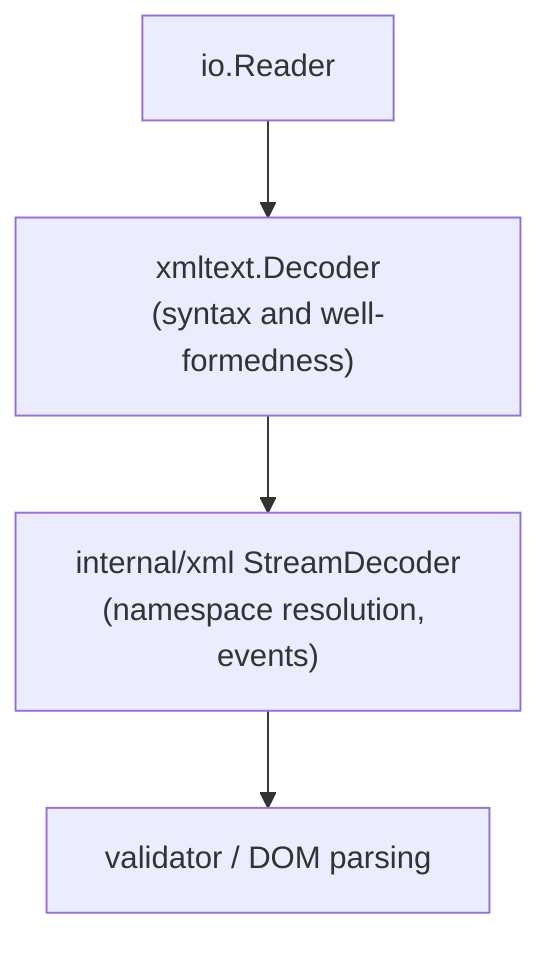

# xmltext architecture

xmltext is the streaming XML 1.0 tokenizer used by the repository. It focuses
on XML 1.0 well-formedness and streaming performance and leaves namespace
resolution and semantic modeling to higher layers.

## Layering

The decoder is a low-level, allocation-light component. It does not resolve
namespaces or build DOM nodes. It only tokenizes and validates syntax.

## Buffer model

- The decoder owns a sliding buffer and uses internal spans into that buffer
  while scanning.
- `ReadTokenInto` copies token bytes into a caller-provided TokenBuffer. The
  returned slices are valid until the next `ReadTokenInto` call that reuses the
  buffer.
- Scratch buffers are used for transformed text (entity expansion and coalesced
  char data) to avoid copying into the main input buffer.

Compaction details:
- The buffer can compact to reclaim space once earlier bytes are no longer
  needed.
- Coalesced char data pins a minimum offset so raw spans stay anchored to the
  original input while the coalesce buffer accumulates text.

## Token model

`ReadTokenInto` fills a `Token` struct with caller-owned slices:
- Start/end element tokens populate `Token.Name` and `Token.Attrs`.
- Text-like tokens (CharData/CDATA/PI/comment/directive) populate `Token.Text`.
- `Token.TextNeeds` and `Attr.ValueNeeds` report unresolved entity references
  when `ResolveEntities(false)` is configured.

Internally the decoder still tracks raw spans into the input buffer for
operations like `ReadValueInto` and for error snippets.

## Entity handling

- ResolveEntities(false): `Token.Text` and `Attr.Value` retain raw entity
  references. Use `Decoder.UnescapeInto` when `TextNeeds`/`ValueNeeds` is true.
- ResolveEntities(true): `Token.Text` and `Attr.Value` contain unescaped bytes.
- Entity parsing applies to character data and attribute values. CDATA is never
  entity-expanded.

## Namespace handling

xmltext does not interpret prefixes or manage namespace scopes. Namespace
resolution is performed by internal/xml, which consumes xmltext tokens and
applies XML Namespaces rules.

## Error model

- Syntax errors return a typed error that includes line, column, and offset.
- After the first error, the decoder stays in an error state until Reset is
  called.

## Options and limits

Common options:
- ResolveEntities(bool)
- Strict(bool)
- CoalesceCharData(bool)
- TrackLineColumn(bool)
- EmitComments(bool), EmitPI(bool), EmitDirectives(bool)
- MaxDepth(int), MaxAttrs(int), MaxTokenSize(int)

Limits are enforced during parsing to guard against hostile inputs.
MaxTokenSize defaults to unlimited; set it for untrusted inputs to cap memory
growth. Tokens exactly MaxTokenSize bytes long are allowed. FastValidation()
leaves MaxTokenSize unset.

Strict validates XML declarations: version must be 1.0, and encoding and
standalone (if present) must follow in that order with valid values.

## Performance notes

- ASCII lookup tables are used for name and whitespace classification.
- Char data scanning uses fast searches for '<' and entity markers.
- Tokenization is streaming and single-pass; no DOM allocation in xmltext.
- Scratch buffers and interning are reused within a decoder instance to keep
  allocations low.

## Scope

xmltext enforces XML 1.0 well-formedness. It does not implement DTD parsing or
external entity resolution. Charset support beyond UTF-8/UTF-16 requires an
explicit charset reader.
